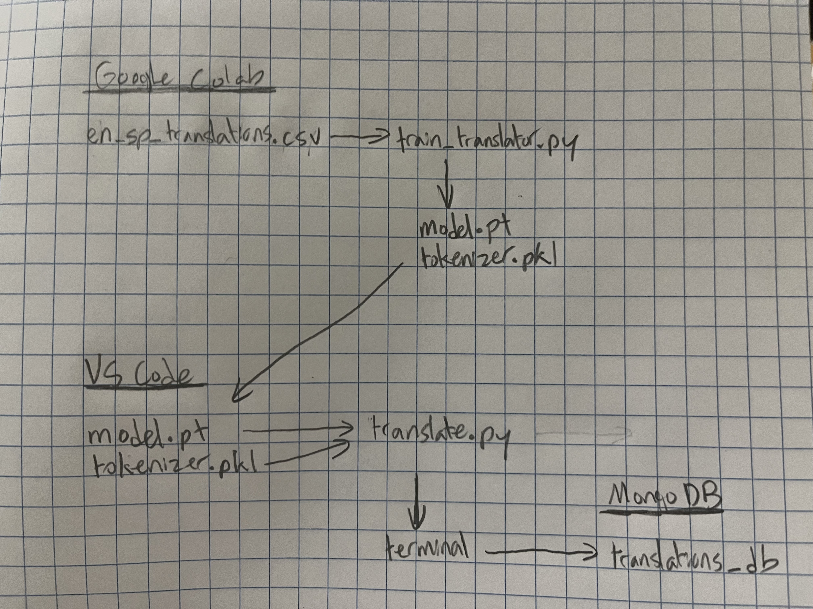
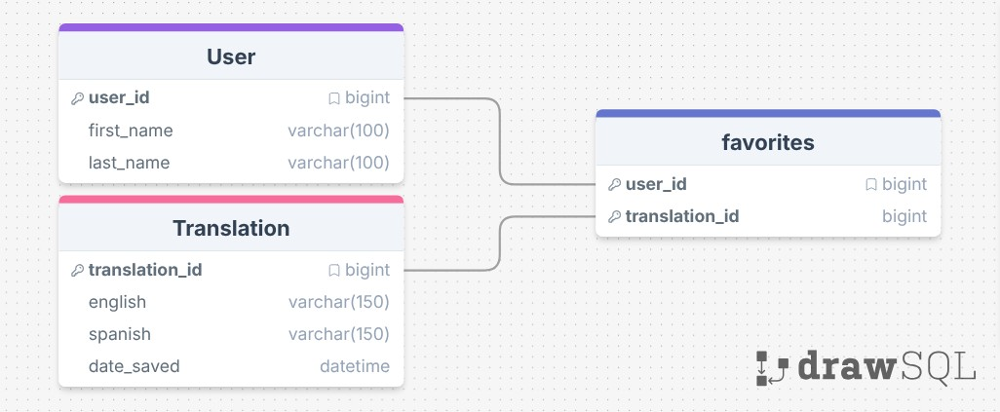

# AI_Translator_En_Es

### en_sp_translations.csv
This is the file containing the sentence pairs in English and Spanish. It is the "fuel" for the training of the transformer model. (In this project, the data is from Tatoeba for the sake of sparing my laptop.)

### train_translator.py
This file takes the CSV file and trains a transformer model. Since I use a Mac, it is in my beest interest to put both of these files in Google Colab and run the script using the T4 GPU setting.

### model.pt and tokenizer.pkl
These files are the essence of the model designed to translate from English to Spanish. The former contains the trained model weights, and tha latter contains the tokenizer vocabulary. The brain, and the dictionary.

Upon use, the tokenizer converts English words into numbers and feeds them into the model. The model takes those numbers and converts them to new numbers. Finally, those new numbers are brought to the tokenizer and converted into Spanish text.

If one file is lost, the other is useless. Both files should therefore be placed in the project folder in VS Code before the Colab runtime is terminated.

### translate.py
This file uses model.pt and tokenizer.pkl and prompts the user to input a sentence in English, then spits out the respective sentence in Spanish. This file also permits the user to interface with the database of saved translations.

### Goals
- Scout websites with potentially larger CSV files that my computer can manage
- Discover improved training methods or values
- Train models of various languages translated in a "strongly connected graph" manner (i.e. en <-> sp, sp <-> jp, jp <-> en)
- Connect software to microphone and speaker for real-time translation of a selected language
- UI improvement and deployment for public use