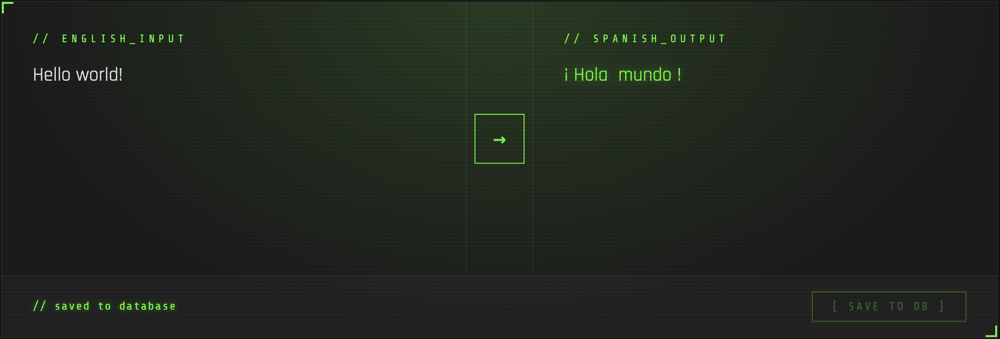

# Report

### Summary
This project involves the training of a transformer model from scratch using a dataset of almost 300k English/Spanish sentence pairs. Although the frondend is local, it includes an interface similar to Google translate, but features a save option for selected translations.

### Diagrams

### Demo Video

### Learning Outcomes

### How the Project Integrates with AI

### Use of AI to Create Project

### Personal Interest

### Strategy and Performance